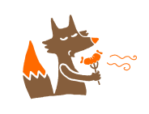

  
A crunched 34 key choc-spaced keyboard.

 

---

# Split

  

  
The original.

### Requirements

- 2x PCB
- 2x MCU board [0xCB Gemini](https://github.com/0xCB-dev/0xCB-Gemini) or [RP2040-Zéro](https://www.waveshare.com/wiki/RP2040-Zero)
- 2x TRRS jack
- 34x switches Choc V1 **only**
- 34x keycaps Choc V1

Optional:
- 23x [Mill Max sockets](https://splitkb.com/collections/keyboard-parts/products/mill-max-low-profile-sockets)
- 34x [kailh hotswap sockets](https://cdn.shopify.com/s/files/1/0588/1108/9090/files/5118-Choc-Socket.pdf?v=1686715063)
- 2x Back PCB + screws and bolts
- 2x [Tenting pucks](https://splitkb.com/collections/keyboard-parts/products/tenting-puck)
- 2x [Tripods](https://www.manfrotto.com/us-en/pocket-support-large-black-mp3-bk/)

### Test

You can print these templates to test if it fits your hands:  
- [Left](./images/shape_left.pdf)
- [Right](./images/shape_right.pdf)

### Firmware

Chew is now running with it's [custom firmware](https://github.com/flinguenheld/rusty_chew) written in rust ! 🦀  

It also runs on [QMK](https://docs.qmk.fm/#/),  you can see it's [folder](https://github.com/qmk/qmk_firmware/tree/master/keyboards/chew) and my [keymap](https://github.com/flinguenheld/qmk_chew).

### How to build

Check the [wiki](https://github.com/flinguenheld/chew/wiki).

### Brainwave

Chew is a mix of these two cool keyboards:  

[Ferris sweep](https://github.com/davidphilipbarr/Sweep)  
[Wubbo](https://github.com/cacheworks/Wubbo)

&nbsp;

  

---

# Mono

  

  
The same, monobloc though !

### Requirements

- 1x PCB
- 1x MCU board [0xCB Gemini](https://github.com/0xCB-dev/0xCB-Gemini) or [RP2040-Zéro](https://www.waveshare.com/wiki/RP2040-Zero)
- 34x [1N4148W SMD diodes](https://splitkb.com/collections/keyboard-parts/products/smd-diodes)
- 34x switches Choc V1 **only**
- 34x keycaps Choc V1

Optional:
- 18x [Mill Max sockets](https://splitkb.com/collections/keyboard-parts/products/mill-max-low-profile-sockets)
- 34x [kailh hotswap sockets](https://cdn.shopify.com/s/files/1/0588/1108/9090/files/5118-Choc-Socket.pdf?v=1686715063)
- 1x Back PCB + screws and bolts

### Test

You can print this [template](./images/shape_mono.pdf) to test if it fits your hands.

### Firmware

The [rusty firmware](https://github.com/flinguenheld/rusty_chew) also works with this version. 🦀  

Or its [QMK folder](https://github.com/qmk/qmk_firmware/tree/master/keyboards/chew_mono) with my [keymap](https://github.com/flinguenheld/qmk_chew).  

### How to build

Check the [wiki](https://github.com/flinguenheld/chew/wiki).

&nbsp;

  

