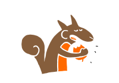
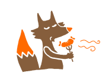

  
A humble 34 key choc-spaced keyboard.

&nbsp;

---

# Split

  

<!--  -->  
  
The original.

### Requirements

- 2x PCB
- 2x MCU board [RP2040-Zéro](https://www.waveshare.com/wiki/RP2040-Zero)
- 2x TRRS jack
- 34x switches Choc V1 **only**
- 34x keycaps Choc V1

Optional:
- 23x [Mill Max sockets](https://splitkb.com/collections/keyboard-parts/products/mill-max-low-profile-sockets)
- 34x [kailh hotswap sockets](https://cdn.shopify.com/s/files/1/0588/1108/9090/files/5118-Choc-Socket.pdf?v=1686715063)
- 2x Back PCB + screws and bolts
- 2x [Tenting pucks](https://splitkb.com/collections/keyboard-parts/products/tenting-puck)
- 2x [Tripods](https://www.manfrotto.com/us-en/pocket-support-large-black-mp3-bk/)

### Test

You can print these templates to test if it fits your hands:  
- [Left](./images/shape_left.pdf)
- [Right](./images/shape_right.pdf)

### Firmware

Chew is running on [QMK](https://docs.qmk.fm/#/).  
You can see its folder [here](https://github.com/qmk/qmk_firmware/tree/master/keyboards/chew).  

The default keymap is just to test the building.  
Nonetheless, you can see my keymap in this [repository](https://github.com/flinguenheld/chew_keymap).

### How to build

Check the [wiki](https://github.com/flinguenheld/chew/wiki).

### Brainwave

Chew is a mix of these two cool keyboards:  

[Ferris sweep](https://github.com/davidphilipbarr/Sweep)  
[Wubbo](https://github.com/cacheworks/Wubbo)

### To do

- [ ] Straight version ?
- [ ] 32 keys version ?

&nbsp;

  

---

# Mono

  

<!--  -->

The same, monobloc though !

### Requirements

- 1x PCB
- 1x MCU board [RP2040-Zéro](https://www.waveshare.com/wiki/RP2040-Zero)
- 34x [1N4148W SMD diodes](https://splitkb.com/collections/keyboard-parts/products/smd-diodes)
- 34x switches Choc V1 **only**
- 34x keycaps Choc V1

Optional:
- 18x [Mill Max sockets](https://splitkb.com/collections/keyboard-parts/products/mill-max-low-profile-sockets)
- 34x [kailh hotswap sockets](https://cdn.shopify.com/s/files/1/0588/1108/9090/files/5118-Choc-Socket.pdf?v=1686715063)
- 1x Back PCB + screws and bolts

### Test

You can print this [template](./images/shape_mono.pdf) to test if it fits your hands.

### Firmware

Its [QMK folder](https://github.com/qmk/qmk_firmware/tree/master/keyboards/chew_mono).  
My [keymap](https://github.com/flinguenheld/chew_keymap) also works with this version. 

### How to build

Check the [wiki](https://github.com/flinguenheld/chew/wiki).

&nbsp;

  

